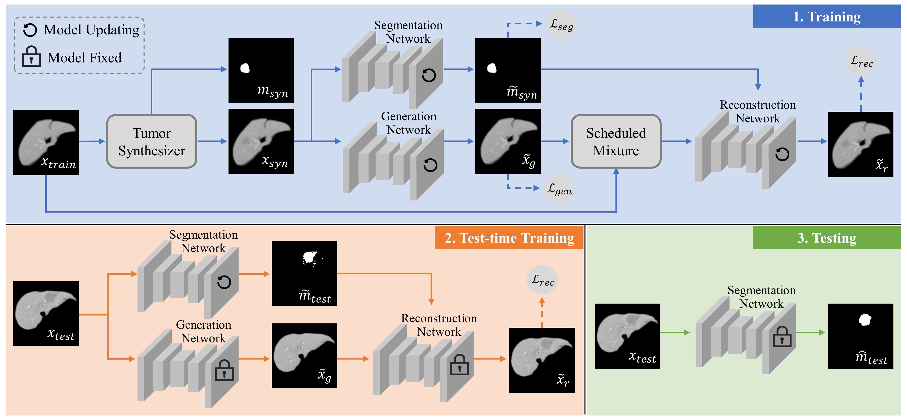

# SR-TTT

Implementation of [Learning From Synthetic CT Images via Test-Time Training for Liver Tumor Segmentation](https://ieeexplore.ieee.org/xpl/tocresult.jsp?isnumber=4359023).

<p align="center">
    
</p>
Overview of the proposed Synthetic-to-Real Test-Time Training (SR-TTT) method for learning from synthetic images in the liver tumor
segmentation task.


## Usage 
1. Packages

    ```python
    pytorch==1.9.0
    ```

2. Data-preprocessing

    ```bash
    ├── Train
    │   ├── D08
    │   │   ├── Config (configure file)
    │   │   ├── Image (CT slices in png format)
    │   │   ├── Liver (liver mask in png format)
    ├── Test
    │   ├── D08
    │   │   ├── Config (configure file)
    │   │   ├── Image (CT slices in png format)
    │   │   ├── Liver (liver mask in png format)
    │   │   ├── Liver_nii (liver mask in nifti format)
    ```
- Convert the nifti images to int32 png format, then subtract 32768 from the pixel intensities to obtain the original Hounsfield unit (HU) values, saved in Image folder, similar to the processing steps in [Deeplesion](https://nihcc.app.box.com/v/DeepLesion/file/306055882594).
- The liver regions can be extracted by a leading liver segmentation model provided by  [nnU-Net](https://nihcc.app.box.com/v/DeepLesion/file/306055882594), saved in Liver(png format) and Liver_nii(nifti format).
- Config, configure file of the dataset.
- Dataset of MSD08 is can be downloaded from the [link](). LiTS dataset can be processed using the above steps, we do not provide all the processed images due to its large dataset size.


3. Training 

    ```python
    python segment_train.py
    ```
    
4. Test-time Training and Testing

    ```python
    python segment_test.py
    ```
    


## Citation
If you find this repository useful for your research, please cite the following: 
```
```
